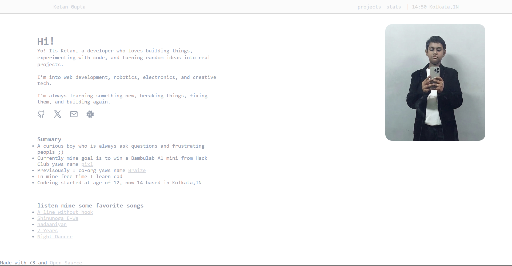

## What is this Project and why I made this

I just thinking lets make a another portfolio website yah its second portfulio of mine i have already made before but thats so colorfull and childish ig so i thought lets make a professional one and cleaner look.

---

## How to run this project locally (or how to clone and modify this project)

### 1. Clone the repository

```bash
git clone https://github.com/itsketangupta/Quizify.git
```

### 2. Open the project folder

```bash
cd Quizify
```

### 3. Run the project

This is a simple frontend project, so you can just open the `index.html` file in your browser.

Or, if you are using VS Code:

"Open with Live Server"

---

## What I learned

First of all i learned the the smol mistake can cause big thing ;) i have suffer a lot i just write a single css property wrong and then thinking were i do mistake then i rewrite the css property into another div then i thought ohh yah ig i write this property into that div and yah that is ;) ig u can understand what i am trying to telling.

---

## Language used

* HTML 61.8%
* CSS 26.2%
* JavaScript 12%

---

## Demo link 



[portfolio](https://itsnotketan.vercel.app/)

Made with <3 and opensaurce also you can see mine previsous portfulio [old portfolio](https://itsketangupta.vercel.app/)